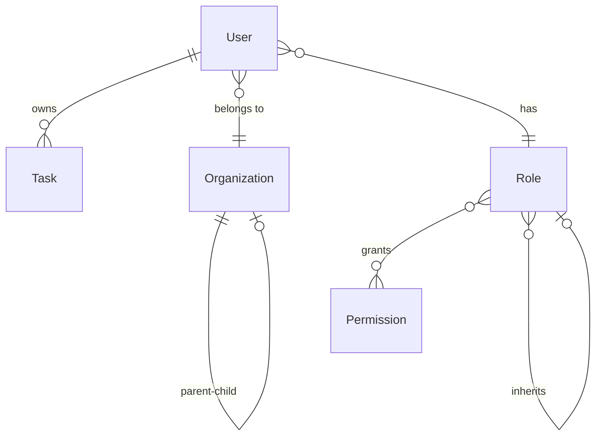

README - Running the Project with Docker Compose
================================================
# Secure Task Management System – Documentation

## 📦 Setup Instructions

### 1. Prerequisites

* **Docker & Docker Compose** installed (recommended)
* Node.js v18+ and npm (if running outside containers)

### 2. Running the apps

#### Using Docker (recommended)

```bash
docker compose up --build
```

This will start:

* **Postgres DB** at `localhost:5432`
* **NestJS API** at `http://localhost:3000`
* **Angular Frontend** at `http://localhost:4200`

#### Running locally without Docker

Backend:

```bash
cd api
npm install
npm run start:dev
```

Frontend:

```bash
cd frontend
npm install
npm start
```

### 3. Environment Variables

Create an `.env` file in the `api/` folder:

```
# Database
DB_HOST=db
DB_PORT=5432
DB_USER=postgres
DB_PASS=postgres
DB_NAME=turbovetsdb

# JWT
JWT_SECRET=supersecretkey
JWT_EXPIRES_IN=3600s
```

> ⚠️ **Note**: Do not commit real secrets in production. Use a secrets manager.

---

## 🏗 Architecture Overview

### NX Monorepo Layout

We use **NX** to manage a monorepo containing both frontend and backend, plus shared libraries:

```
apps/
 ├── api/         # NestJS backend
 └── frontend/    # Angular frontend
libs/
 ├── auth/        # Shared authentication decorators, guards
 ├── data/        # DTOs, interfaces, shared models
 └── utils/       # Utility functions (logging, helpers)
```

**Rationale**:

* Ensures consistency across frontend & backend
* Single source of truth for DTOs and models
* Easier to scale with more apps/services

---

## 📊 Data Model Explanation

### Entities

* **User**

  * Belongs to an Organization
  * Has one Role
* **Role**

  * Contains many Permissions
  * Can inherit from a parent Role
* **Permission**

  * Represents a granular action (e.g. `task.read`)
* **Organization**

  * Can have parent-child structure for hierarchy
* **Task**

  * Owned by a User
  * Belongs to an Organization

### ERD



---

## 🔐 Access Control Implementation

### Roles & Permissions

* **Owner**

  * Can create, read, update, delete *only their own tasks*
* **Admin**

  * Can manage all tasks across the organization
  * Can view users
* **Viewer**

  * Can only view tasks and users

Permissions are stored as strings (`task.read`, `task.create`, etc.) and assigned to Roles.
A join table (`role_permissions_permission`) links roles and permissions.

### Organization Hierarchy

* Organizations can have **parent-child relationships**
* Users belong to a specific Organization
* Access to resources can be restricted within the user’s organization context

### JWT Authentication & Access Control

1. User logs in and receives a JWT:

   ```json
   {
     "sub": "user_id",
     "email": "user@example.com",
     "permissions": ["task.read", "task.create"]
   }
   ```

2. Every request includes `Authorization: Bearer <token>` header.

3. **Guards**:

   * `JwtAuthGuard` validates the JWT.
   * `PermissionsGuard` checks if the user’s permissions include those required by the endpoint:

     ```ts
     @Get()
     @Permissions('task.read')
     findAll() { ... }
     ```

4. For **Owner vs Admin** distinction:

   * Both may have `task.read` permission.
   * Business logic (e.g. `TasksService`) ensures that Owners only see their own tasks while Admins see all.

---

## ✅ Summary

* Docker-first setup for consistent local development
* NX monorepo for full-stack management
* Clear data model with roles, permissions, and organizations
* JWT-based authentication integrated with granular access control
* Owners restricted to their own resources, Admins have broader scope
